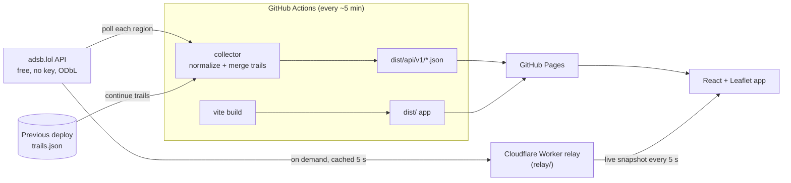

# Entity Monitor

A live flight-monitoring dashboard on GitHub Pages. Positions stream in every 5 seconds through
a small Cloudflare Worker relay, and a scheduled GitHub Actions job publishes snapshots and
history trails as a static JSON API, so the page loads instantly and keeps working without the relay.

**Live site:** https://aidenlyt.github.io/entity-monitor/

- **Live map** of aircraft in six preset regions (London, Frankfurt, New York, Los Angeles,
  Singapore, and worldwide military), rotated by heading and coloured by altitude. Between
  updates, aircraft glide along their track at their ground speed.
- **Search and filters**: callsign, ICAO hex, registration or type; altitude and speed bounds;
  hide on-ground; military only; emergencies only (squawk 7500/7600/7700 or ADS-B emergency).
- **History trails**: the selected aircraft's recent track coloured by altitude, or every
  visible aircraft's trail at once.
- Shareable URLs (`#region=london&hex=4ca92d`), light/dark theme, mobile layout.

## Architecture



GitHub Pages can only serve static files, and adsb.lol does not allow cross-origin browser
requests, so the browser never calls the upstream API directly. Instead:

1. [`deploy.yml`](.github/workflows/deploy.yml) runs on a 5-minute cron (and on every push to `main`).
2. It builds the app, then runs the **collector** ([`collector/`](collector/)), which polls each
   region twice, normalizes the raw readsb records and appends positions to per-aircraft trails.
   Trails persist between runs by reading the previous `trails.json` back from the live site,
   so the repository never accumulates data commits.
3. If a region fails upstream, the collector republishes that region's previous snapshot and
   marks it `fresh: false`, so one bad response never blanks the site.
4. The app ([`src/`](src/)) draws the deployed snapshot immediately, then switches to the
   **live relay** and polls it every 5 s while the tab is visible. It shows whichever snapshot is
   newer, so a relay outage just falls back to the deployed data. Live positions extend the
   deployed trails.
5. Between updates, markers are projected forward along each aircraft's track (dead reckoning,
   capped at 20 s) by one animation loop that moves Leaflet markers directly, so animation
   never re-renders React.

The API contract shared by both sides lives in [`shared/model.ts`](shared/model.ts).

### Live relay

adsb.lol blocks cross-origin requests, so browsers can't poll it directly. The relay
([`relay/`](relay/)) is a Cloudflare Worker that fetches a region when a viewer asks for it,
normalizes it with the collector's code, and returns it with CORS headers for the allowed origins.

- **Caching:** each region is fetched upstream at most once per 5 s per Worker isolate, and
  concurrent requests share a single upstream call. The Cache API is a no-op on `workers.dev`,
  so the cache lives in memory.
- **Failures:** a 429 pauses upstream calls for 15 s, and meanwhile the last good snapshot
  (up to 10 min old) is served. If nothing usable is cached, it returns 503/502.
- **Clock skew:** the response's `X-Snapshot-Age` header lets the browser place the data on
  its own clock, so animation stays correct even when the viewer's clock is off.

| Route | Returns |
| --- | --- |
| `GET /v1/regions/{id}/live` | A `Snapshot` (same shape as `latest.json`). |
| `GET /v1/health` | `{ "ok": true }` |

**Setup (one time).** Run `bash scripts/setup-live-relay.sh` (Git Bash on Windows). It opens each
page, validates what you paste, stores the secrets with `gh`, deploys the relay, and turns live
mode on. The manual equivalent: [`relay.yml`](.github/workflows/relay.yml) deploys the Worker on
every push to `main` that touches it, once these repository secrets exist:

1. Create a free account at [dash.cloudflare.com](https://dash.cloudflare.com), open
   **Workers & Pages** once so it assigns you a `workers.dev` subdomain, and copy your
   **Account ID** from that page.
2. Go to **My Profile → API Tokens → Create Token** and use the **Edit Cloudflare Workers** template.
3. Save both as secrets: `gh secret set CLOUDFLARE_API_TOKEN` and `gh secret set CLOUDFLARE_ACCOUNT_ID`.
4. Run **Actions → Deploy relay → Run workflow**. Then set its URL as a repository variable,
   e.g. `gh variable set RELAY_URL --body https://entity-monitor-relay.<subdomain>.workers.dev`.
   The next site deploy (within ~5 min) turns live mode on.

Allowed browser origins and the cache TTL are set in [`relay/wrangler.jsonc`](relay/wrangler.jsonc).

### Why flights and adsb.lol

| Option | Verdict |
| --- | --- |
| **adsb.lol** | Free, no key, unfiltered, ODbL-licensed. Chosen. Rate limits bursts, so the collector spaces requests 8 s apart and retries 429s with backoff. |
| OpenSky Network | Free, but 400 anonymous requests/day, and CORS is locked to its own site. |
| airplanes.live | Blocked scripted requests (403) during evaluation. |
| AISStream.io (vessels) | Needs an API key and is WebSocket-only; a key in a static site would be public. |

## Published API

All paths are relative to the site root. Data is refreshed on each deploy.

| Path | Contents |
| --- | --- |
| `api/v1/meta.json` | Regions, per-region status (`fresh`, `aircraftCount`, `sourceTime`, `error`), source and licence. |
| `api/v1/regions/{id}/latest.json` | `Snapshot`: every aircraft with a position reported within 60 s. |
| `api/v1/regions/{id}/trails.json` | `Trails`: up to 60 points per aircraft from the last 45 min, as `[lat, lon, altitudeFt, epochSec]`. |

## Development

Requires Node 22+.

```sh
npm install
npm run data:local   # fetch live data into public/api (not committed)
npm run dev          # http://localhost:5173
```

To develop against the live relay, run `npm run relay:dev` (serves on `http://localhost:8787`)
and start the app with `VITE_RELAY_URL=http://localhost:8787 npm run dev`.

| Script | What it does |
| --- | --- |
| `npm run dev` / `build` / `preview` | Vite dev server, production build, and a local preview of the build. |
| `npm run collect -- --out dist` | Run the collector, writing the JSON API into `dist`. |
| `npm run relay:dev` / `relay:deploy` / `relay:check` | Run the Worker locally, deploy it, or dry-run the bundle. |
| `npm test` | Unit tests (Vitest) for normalization, trails, collection, the relay, motion, filters and formatting. |
| `npm run typecheck` | TypeScript for the app, the collector and the relay. |

Collector settings (environment variables): `SAMPLES` (polls per run, default 1),
`SAMPLE_INTERVAL_SEC` (default 60), `REQUEST_GAP_SEC` (default 8) and `PREVIOUS_BASE_URL`
(where to read previous trails from). Regions are configured in
[`collector/regions.ts`](collector/regions.ts); each region adds one request per sample.

## Deployment

Pages is configured to deploy from GitHub Actions. Merging to `main` deploys immediately;
after that the cron keeps data current. To refresh by hand: **Actions → Collect & deploy → Run workflow**.

## Limitations

- **Without the relay, data is 5–15 minutes old.** GitHub runs scheduled workflows on a
  best-effort basis and often delays them. The header shows "Live" when streaming, and otherwise
  the data's age, with a warning past 30 minutes.
- **Relay quota:** a visible tab makes one request per 5 s (720 per hour). Cloudflare's free tier
  allows 100,000 requests per day, about 140 viewer-hours. Hidden tabs don't poll.
- **GitHub disables scheduled workflows after 60 days without repository activity.** Re-enable
  it from the Actions tab, or push a commit.
- adsb.lol plans to require an API key (obtained by feeding it data) in the future. If that
  happens, add the key as a repository secret and send it from `collector/adsblol.ts`.
- Map tiles come from the OpenStreetMap tile servers, whose
  [usage policy](https://operations.osmfoundation.org/policies/tiles/) suits low-traffic sites.
  Switch tile providers if the site gets heavy traffic.
- Coverage depends on volunteer receivers and is thin over oceans and remote areas.

## Credits

Flight data © [adsb.lol](https://adsb.lol) contributors, available under the
[Open Database License](https://opendatacommons.org/licenses/odbl/1-0/). Map tiles ©
[OpenStreetMap](https://www.openstreetmap.org/copyright) contributors.
