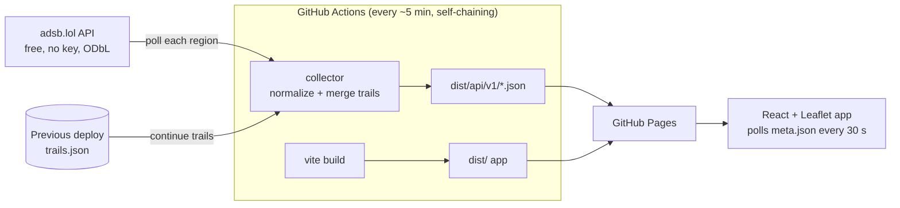

# Flight Monitor

A live flight-monitoring dashboard that runs entirely on GitHub: a scheduled GitHub Actions
workflow acts as the backend, and GitHub Pages serves both the web app and a static JSON API.

**Live site:** https://aidenlyt.github.io/flight-monitor/

- **Live map** of aircraft in six preset regions (London, Frankfurt, New York, Los Angeles,
  Singapore, and worldwide military), rotated by heading and coloured by altitude.
- **Search and filters**: callsign, ICAO hex, registration or type; altitude and speed bounds;
  hide on-ground; military only; emergencies only (squawk 7500/7600/7700 or ADS-B emergency).
- **History trails**: the selected aircraft's recent track coloured by altitude, or every
  visible aircraft's trail at once.
- Shareable URLs (`#region=london&hex=4ca92d`), light/dark theme, mobile layout.

## Architecture



GitHub Pages can only serve static files, and adsb.lol does not allow cross-origin browser
requests, so the browser never calls the upstream API directly. Instead:

1. [`deploy.yml`](.github/workflows/deploy.yml) runs about every 5 minutes. Each run starts the
   next one when it finishes, because GitHub's cron often delays or skips frequent schedules. A
   half-hourly cron only restarts the chain if it ever stops.
2. It builds the app, then runs the **collector** ([`collector/`](collector/)), which polls each
   region twice, normalizes the raw readsb records and appends positions to per-aircraft trails.
   Trails persist between runs by reading the previous `trails.json` back from the live site,
   so the repository never accumulates data commits.
3. If a region fails upstream, the collector republishes that region's previous snapshot and
   marks it `fresh: false`, so one bad response never blanks the site.
4. The app ([`src/`](src/)) polls `meta.json` every 30 s, and fetches a region's snapshot and
   trails only when a new deploy has landed.

The API contract shared by both sides lives in [`shared/model.ts`](shared/model.ts).

### Why flights and adsb.lol

| Option | Verdict |
| --- | --- |
| **adsb.lol** | Free, no key, unfiltered, ODbL-licensed. Chosen. Rate limits bursts, so the collector spaces requests 8 s apart and retries 429s with backoff. |
| OpenSky Network | Free, but 400 anonymous requests/day, and CORS is locked to its own site. |
| airplanes.live | Blocked scripted requests (403) during evaluation. |
| AISStream.io (vessels) | Needs an API key and is WebSocket-only; a key in a static site would be public. |

## Published API

All paths are relative to the site root. Data is refreshed on each deploy.

| Path | Contents |
| --- | --- |
| `api/v1/meta.json` | Regions, per-region status (`fresh`, `aircraftCount`, `sourceTime`, `error`), source and licence. |
| `api/v1/regions/{id}/latest.json` | `Snapshot`: every aircraft with a position reported within 60 s. |
| `api/v1/regions/{id}/trails.json` | `Trails`: up to 60 points per aircraft from the last 45 min, as `[lat, lon, altitudeFt, epochSec]`. |

## Development

Requires Node 22+.

```sh
npm install
npm run data:local   # fetch live data into public/api (not committed)
npm run dev          # http://localhost:5173
```

| Script | What it does |
| --- | --- |
| `npm run dev` / `build` / `preview` | Vite dev server, production build, and a local preview of the build. |
| `npm run collect -- --out dist` | Run the collector, writing the JSON API into `dist`. |
| `npm test` | Unit tests (Vitest) for normalization, trails, collection, filters and formatting. |
| `npm run typecheck` | TypeScript for the app and the collector. |

Collector settings (environment variables): `SAMPLES` (polls per run, default 1),
`SAMPLE_INTERVAL_SEC` (default 60), `REQUEST_GAP_SEC` (default 8) and `PREVIOUS_BASE_URL`
(where to read previous trails from). Regions are configured in
[`collector/regions.ts`](collector/regions.ts); each region adds one request per sample.

## Deployment

Pages is configured to deploy from GitHub Actions. Merging to `main` deploys immediately and
starts the 5-minute chain. The cycle length is `CYCLE_SEC` in [`deploy.yml`](.github/workflows/deploy.yml).

- **Refresh now:** Actions → Collect & deploy → Run workflow. This won't start a second chain,
  because a run only starts the next one when nothing else is queued.
- **Pause collection:** Actions → Collect & deploy → ⋯ → Disable workflow. Re-enable it and run
  it once to resume.

## Limitations

- **Data is 1–6 minutes old.** Each run publishes data about a minute after its last pull, and
  runs start about 5 minutes apart. The header shows the data's age and warns past 15 minutes.
  GitHub-hosted runners occasionally queue for a few minutes, which adds delay.
- **Actions usage:** the chain keeps roughly one short job running at all times. That's free for
  public repositories. On a private repo it would bill about 1,900 minutes a day (288 runs of
  6–7 billed minutes each), nearly the whole 2,000-minute monthly free allowance. Pause it or
  lengthen `CYCLE_SEC` if the repo goes private.
- **GitHub disables scheduled workflows after 60 days without repository activity.** Re-enable
  it from the Actions tab, or push a commit.
- adsb.lol plans to require an API key (obtained by feeding it data) in the future. If that
  happens, add the key as a repository secret and send it from `collector/adsblol.ts`.
- Map tiles come from the OpenStreetMap tile servers, whose
  [usage policy](https://operations.osmfoundation.org/policies/tiles/) suits low-traffic sites.
  Switch tile providers if the site gets heavy traffic.
- Coverage depends on volunteer receivers and is thin over oceans and remote areas.

## Credits

Flight data © [adsb.lol](https://adsb.lol) contributors, available under the
[Open Database License](https://opendatacommons.org/licenses/odbl/1-0/). Map tiles ©
[OpenStreetMap](https://www.openstreetmap.org/copyright) contributors.
